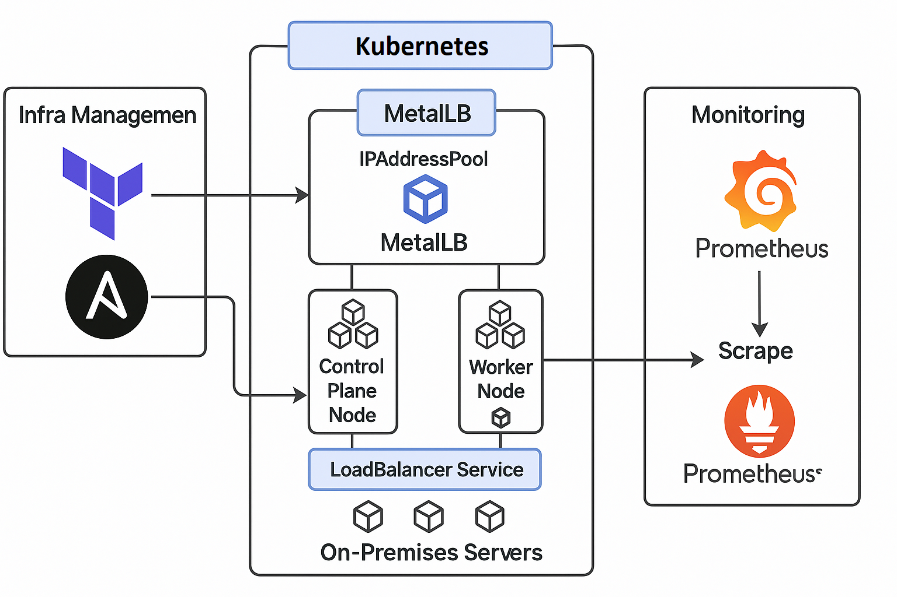

# Kubernetes On-Prem Project: Automated Deployment with Monitoring

This project demonstrates how to deploy a Kubernetes cluster on on-premise servers using Ansible and Terraform, with a complete monitoring stack (Prometheus + Grafana), MetalLB for LoadBalancer support, and TLS-secured Ingress.

---



---

## 🔧 Components
- **Infrastructure**: On-prem (bare-metal or VM)
- **Cluster Tooling**: kubeadm, kubelet, containerd, kubectl
- **Automation**:
  - Ansible for installing K8s prerequisites
  - Terraform for Helm releases (Prometheus & Grafana)
- **Networking**: MetalLB (L2 Mode)
- **Monitoring**: Prometheus and Grafana
- **Ingress**: NGINX with TLS support

---

## 🗂️ Folder Structure
```
k8s-onprem-project/
├── terraform/
│   ├── main.tf
│   ├── variables.tf
│   └── outputs.tf
├── ansible/
│   ├── inventory.ini
│   └── k8s-setup.yml
├── manifests/
│   ├── app-deployment.yaml
│   ├── ingress.yaml
│   ├── metallb-config.yaml
│   └── tls-secret.yaml
├── monitoring/
│   ├── prometheus-grafana.tf
│   └── grafana-dashboard.json
└── README.md

```

---

## ✅ Step-by-Step Guide

### 1️⃣ Prepare Inventory
Edit `ansible/inventory.ini` with your master/worker IPs.

### 2️⃣ Run Ansible Playbook
```bash
cd ansible/
ansible-playbook -i inventory.ini k8s-setup.yml
```

### 3️⃣ Initialize Kubernetes Cluster
SSH into master node:
```bash
kubeadm init --control-plane-endpoint="<VIP or DNS>" --upload-certs
```

Set up `kubectl` config:
```bash
mkdir -p $HOME/.kube
sudo cp /etc/kubernetes/admin.conf $HOME/.kube/config
sudo chown $(id -u):$(id -g) $HOME/.kube/config
```

Join worker nodes using `kubeadm join ...` command.

### 4️⃣ Apply MetalLB Configuration
```bash
kubectl apply -f manifests/metallb-config.yaml
```

### 5️⃣ (Optional) Create TLS Secret
```bash
openssl req -x509 -nodes -days 365 -newkey rsa:2048 \
  -keyout tls.key -out tls.crt \
  -subj "/CN=myapp.local/O=myapp"

kubectl create secret tls myapp-tls \
  --cert=tls.crt --key=tls.key
```

### 6️⃣ Deploy Monitoring Stack using Terraform
```bash
cd terraform/
terraform init
terraform apply
```

### 7️⃣ Deploy Application & Ingress
```bash
kubectl apply -f manifests/app-deployment.yaml
kubectl apply -f manifests/ingress.yaml
```

### 8️⃣ Import Grafana Dashboard (Optional)
- Use Grafana web UI → Dashboards → Import → Upload JSON (`monitoring/grafana-dashboard.json`)

---

## 🌐 Access Points
- **App**: `http://<LoadBalancer-IP>` or `http://myapp.local` (if DNS configured)
- **Grafana**: `http://<NodeIP>:3000` (Login: `admin` / `admin`)
- **Prometheus**: `http://<NodeIP>:9090`

---

## 📌 Notes
- You can replace the sample app (nginx) with your actual workloads.
- Replace the TLS cert/key with your own or use cert-manager.
- Use kubeadm HA setup if you want production-grade control plane.

---

For enhancements like cert-manager, dynamic dashboards, or app autoscaling, feel free to request extensions!
